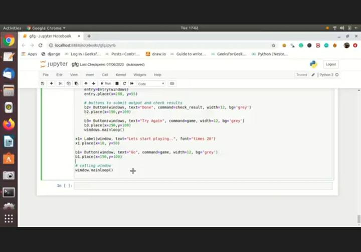

# SPEED-TYPE-DETECTION-USING-PYTHON
This project is used to find the speed of typing . In this project , we have created a program that tests the typing speed of the users with the basic GUI application using python language. Python libraries like tkinter &amp; timeit is used for the gui &amp; calculation of time for speed type testing . By using this project , we can able to improve our typing skill &amp; our concentration .
With the python project , learn to build an application using pygame library that can detect typing speed of user with accuracy & words per  minute. 

